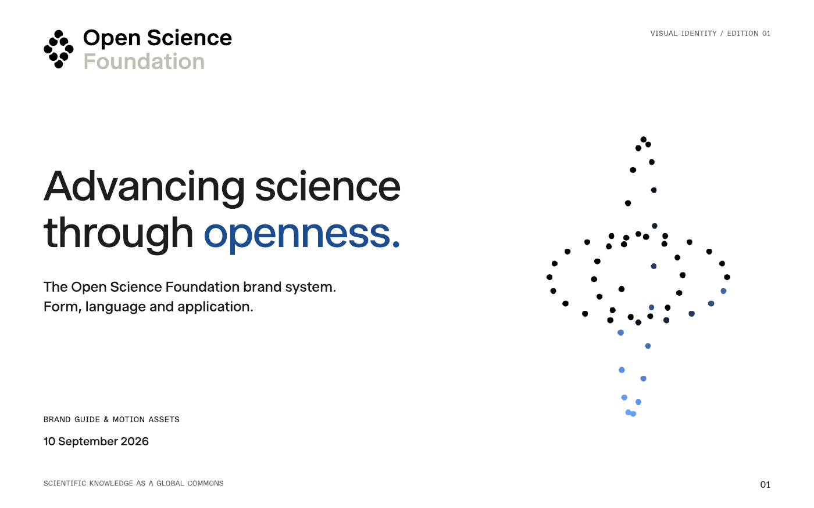

<!-- SPDX-FileCopyrightText: 2026 Open Science Stiftung (Open Science Foundation) -->
<!-- SPDX-License-Identifier: CC-BY-4.0 -->

# Open Science Foundation brand guide

| Content | Licence |
|---|---|
| Guideline prose, documentation and this README | [CC BY 4.0](LICENSES/CC-BY-4.0.txt) |
| Tokens, CSS, machine-readable recipes, agent skills, agent instructions, validation code, administrative metadata and CI configuration | [Apache-2.0](LICENSES/Apache-2.0.txt) |
| Copied website source, component specs and derived web tokens in `web-harness/` | [MIT](LICENSES/MIT.txt); exact scope in REUSE.toml |
| Logo and wordmark artwork in `assets/logo/` | [OSF Brand Assets Permission](LICENSES/LicenseRef-OSF-Brand-Assets.txt), **not an open licence**; see [TRADEMARK.md](TRADEMARK.md) |
| Archived website motion artwork, videos and posters | Existing rights retained; [media notice](LICENSES/LicenseRef-OSF-Website-Media.txt) |
| Dated visual PDF and cover | Composite: CC BY prose plus separately scoped logo and media rights |
| Commercial fonts, other photographs and the original Office template kit | Not included or licensed by this repository; see [external assets](docs/external-assets.md) |

[LICENSE](LICENSE) is the scope index. File headers, adjacent `.license` notices and [REUSE.toml](REUSE.toml) identify the applicable terms. There is no blanket licence for the whole repository.

Guidelines for the Open Science Foundation (OSF), operated by Open Science Stiftung, based on [opening.science](https://opening.science). The Open Science Institute (OSI) is funded and governed by OSF.

**Repository visibility observed 10 September 2026: public.** The dated visual guide and motion archive are published at the owner’s explicit request. Older private-visibility wording was stale. The legal-review receipt status remains unverified and is still recorded as `awaiting_receipt`; publication does not assert that review was completed.

GitHub access controls do not turn the CC BY or Apache terms into confidentiality obligations. Those licences apply now and permit redistribution under their terms by recipients with access. Confidential documents and uncleared assets therefore stay outside this repository and its history.


## Visual guide · 10 September 2026

[Download the 26-page PDF](docs/Open-Science-Foundation-brand-guide-2026-09-10.pdf) · [Readable text](docs/brand-guide-2026-09-10-text.md) · [Build source](docs/guide/README.md)

[](docs/Open-Science-Foundation-brand-guide-2026-09-10.pdf)

This visual edition covers purpose, voice, the original logo family, clear space, colour, contrast, typography, layout, motion and application examples. It uses the existing **01 Open editorial** identity. The PDF uses vector outlines; no commercial font software is bundled.

### Website animations and videos

The [motion archive](assets/motion/README.md) includes all six procedural brand animations as original source, GIF and MP4 exports, PNG stills and a runnable preview gallery. It also includes all five website MP4s and four original posters, plus the associated animation and transition source snapshots.

Source and media retain separate rights. See the [provenance record](assets/motion/PROVENANCE.md) and [hash manifest](assets/motion/manifest.json). The repository was renamed from `Opening-Science/osf-brand` to `Opening-Science/Open-Science-Foundation-brand-guide` for this edition. Its existing public visibility is retained.

## Start here

- [Brand guide](docs/brand-guide.md), [formats](docs/formats.md) and [layout options and selected default](docs/options.md).
- [AGENTS.md](AGENTS.md) for repository work; [SKILL.md](SKILL.md) for creating communications.
- [Agent setup](docs/agent-setup.md), including authenticated access and version pinning.
- [Licensing review](docs/licensing-review.md) and [public-release checklist](docs/public-release.md).

**01 Open editorial is the owner-selected, fixed default**, selected on 8 September 2026. Use it across all formats unless the user explicitly requests another option. Options 02 to 05 are retained alternatives. The website theme remains authoritative; these are medium-specific adaptations.

## Website harness

Use the [website harness](web-harness/README.md) for a runnable Nuxt starter,
portable agent instructions, admitted components and design checks. Copied
website source retains MIT; new tooling uses Apache-2.0. Fonts remain external.

## Editable templates

The five PowerPoint/Keynote systems, social canvases and A4/Letter Word templates remain in `06_Communications_Brand/OSF_Brandkit` in the organisation's existing Proton Drive. Give an authorised agent that folder or the specific editable template. This repository is the guidelines and agent layer, not a mirror of the Office kit. [Why the files are separate](docs/external-assets.md).

Future asset-free template code can be admitted under Apache-2.0. Embedded logos retain their separate permission, and any photograph or font retains its own rights. A directory name or an MIT/Apache notice cannot relicense embedded media.

## Checks and contributions

Use Python 3.11 or later. No runtime dependencies are needed:

```sh
python3 scripts/check.py
python3 scripts/check-web-harness.py
python3 scripts/check-motion.py
python3 -m unittest discover -s tests -v
```

The checks enforce licence coverage, asset boundaries, source hashes, token consistency, skill links and proposal status. CI runs these checks with read-only repository permissions. See [CONTRIBUTING.md](CONTRIBUTING.md).

See [GitHub protection status](docs/github-protections.md) for the applied settings and the branch protections currently blocked by GitHub's plan restrictions.

Use a reviewed commit or release for reproducible agent work. Follow the owner’s publication instructions and preserve existing rights. Do not infer receipt of legal review from repository visibility.
