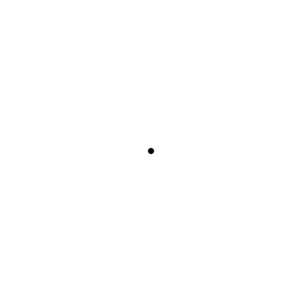

<!-- SPDX-FileCopyrightText: 2026 Open Science Stiftung (Open Science Foundation) -->
<!-- SPDX-License-Identifier: CC-BY-4.0 -->

# OSF website motion assets

Edition: **10 September 2026**. All six procedural brand animations are included, with original source, convenient recorded exports and a runnable gallery. The five website videos and four existing video posters are archived separately.

## Animation catalogue

| Asset | Particles | Original behaviour | Downloads |
|---|---:|---|---|
| Hero rings | 54 | 8,000 ms idle | [GIF](exports/hero.gif), [MP4](exports/hero.mp4), [still](exports/hero-still.png) |
| Openness / rings | 54 | 4,000 ms idle | [GIF](exports/openness.gif), [MP4](exports/openness.mp4), [still](exports/openness-still.png) |
| Transparency / sphere | 60 | 4,000 ms idle | [GIF](exports/transparency.gif), [MP4](exports/transparency.mp4), [still](exports/transparency-still.png) |
| Collaboration / torus knot | 30 | 4,000 ms idle; starts paused | [GIF](exports/collaboration.gif), [MP4](exports/collaboration.mp4), [still](exports/collaboration-still.png) |
| Reproducibility / cube grid | 27 | 4,000 ms idle | [GIF](exports/reproducibility.gif), [MP4](exports/reproducibility.mp4), [still](exports/reproducibility-still.png) |
| Interactive logo | 8 or 9 | Hover cycles diamond, circle and radial | [GIF](exports/logo.gif), [MP4](exports/logo.mp4), [still](exports/logo-still.png) |



The GIF/MP4 files are 10.05-second recordings at 20 fps on white. They contain the original engine's frames, not newly drawn approximations. They are convenience previews and are not guaranteed seamless at the recording boundary. Use the live source for responsive, interactive and reduced-motion-aware implementations. GIFs do not provide reduced-motion support; use a still or explicit controls.

## Run the gallery

Use Node 22.12+:

```sh
cd assets/motion
npm ci
npm run dev
```

Open the local URL printed by Vite. The gallery uses the exact original Vue components and p5 formation engine. Hover the compact logo to cycle its formations. The pause button controls gallery playback. Operating-system reduced-motion preferences retain the original source behaviours. `npm run build` verifies a portable relative-path build in ignored `dist/`.

Selecta and ABC Diatype Semi Mono are resolved only from a licensed local installation. No font binaries are included. If fonts are absent, gallery text uses an explicitly documented system fallback for technical inspection; it is not an approved OSF design substitution. The animation canvases have no font dependency.

## Files

- `source/app/components/sketch/`: original `LogoMark.vue` and `SketchCanvas.vue`.
- `source/app/composables/`: original engine, five formation factories, configuration manifest and reduced-motion composable.
- Other `source/` files: unchanged contextual snapshots of the website's transitions, animation consumers and motion reference files. These are records of implementation context, not a second full website starter. Some need their original application dependencies.
- `exports/`: six GIFs, six MP4s and six PNG stills.
- `videos/`: five unchanged MP4s and four unchanged poster images from the website.
- [manifest.json](manifest.json): complete original-source and export inventory, source commit and SHA-256 hashes.
- [PROVENANCE.md](PROVENANCE.md): scope, credits and rights.

The original source is kept byte-for-byte. The gallery and export hooks are separate implementation files. Update by comparing a specific website commit, recording new hashes and rechecking the source, media and rendered outputs.
